# Lab 7: Connect AKS to Azure OpenAI with Azure DevOps

This is the Azure DevOps and Azure portal path for AKS Automatic and Azure
OpenAI. It imports the Contoso Air application into Azure Repos, deploys it to
the existing lab AKS cluster with Azure Automated Deployments, and connects the
application to Azure OpenAI. You do not need Bash, Azure CLI, or `kubectl`.

The screenshots below come from the
[AKS Automatic lab](https://azure-samples.github.io/aks-labs/docs/getting-started/aks-automatic/).
This option follows the source lab's `dev` namespace and Contoso Air
application.

## Before you start

You should already have:

- The Azure resource group and shared resources from the earlier lab steps.
- The existing AKS cluster provisioned in the earlier lab steps.
- A user-assigned managed identity whose name normally begins with `myidentity`.
- An Azure DevOps organization and a project where you can create repositories,
  pipelines, and service connections.
- **Contributor** and **User Access Administrator** roles on the lab resource
  group.

The **DevHub GitHub OAuth** role is not needed for this exercise.

> Azure OpenAI model availability and quota vary by subscription and region.
> This path creates an Azure OpenAI account and model deployment. These
> resources may incur charges, but the path reuses the existing AKS cluster.

## 1. Create an Azure OpenAI resource

1. Open the [Azure portal](https://portal.azure.com/).
2. Search for **Azure OpenAI**, select it, and then select **Create**.
3. On **Basics**, enter:

   | Setting | Value |
   | --- | --- |
   | Subscription | The subscription used for this lab |
   | Resource group | The resource group used for this lab |
   | Region | Prefer the same region as the AKS cluster |
   | Name | A globally unique name, such as `myopenai-<your initials>` |
   | Pricing tier | `Standard S0` |

4. Select **Next** through the remaining tabs. Leave public network access
   enabled for this lab.
5. Select **Review + submit** and then **Create**.
6. When deployment finishes, select **Go to resource**.

## 2. Deploy a chat model

1. On the Azure OpenAI resource overview, select **Go to Azure AI Foundry
   portal**. If it is not shown, open [Azure AI Foundry](https://ai.azure.com/)
   and select the Azure OpenAI resource.
2. Select **Model deployments** or **Deployments**.
3. Select **Deploy model** > **Deploy base model**.
4. Select `gpt-5.4-mini`. If unavailable, choose another chat-completion model
   available to your subscription and region.
5. Set the deployment name to the model name, keep the default deployment type,
   choose the smallest available capacity, and select **Deploy**.
6. Open the deployment in **Chat playground**, send a short message, and confirm
   that the model replies.

Keep the Azure OpenAI resource and deployment names available.

## 3. Import Contoso Air into Azure Repos

1. Open [Azure DevOps](https://dev.azure.com/) and select your organization and
   project.

   If this is your first time using Azure DevOps, select **Continue** to finish
   setting up your profile.

   

   If you do not have an organization, select **Create new organization**.

   

   Enter a unique organization name, choose the region where your projects
   will be hosted, select the lab subscription, and select **Continue**. Create
   a project for the lab when prompted.

   

2. In your project, select **Repos** > **Files**.
3. From the repository selector, select **Import repository**. If the project
   has no repository, select **Import** on the welcome page.
4. Enter these values:

   | Setting | Value |
   | --- | --- |
   | Repository type | **Git** |
   | Clone URL | `https://github.com/Azure-Samples/contoso-air.git` |
   | Name | `contoso-air` |

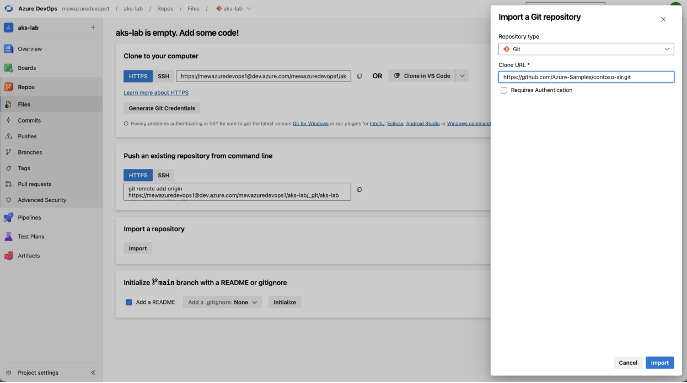

5. Select **Import** and wait for the `main` branch to appear.
6. Confirm that `src/web/Dockerfile` exists in the imported repository.

## 4. Start an Automated Deployment

1. Sign in to the [Azure portal](https://portal.azure.com/).
2. Search for **Kubernetes services** and open it.
3. Select **+ Create** > **Deploy application**.


4. On **Basics**, select **Deploy your application**.
5. Select the lab subscription and resource group.
6. Set **Workflow name** to `contoso-air-<your-name>`, replacing
   `<your-name>` with your name (for example, `contoso-air-alex`).
7. Select **Authorize access** if Azure asks for access to Azure DevOps.

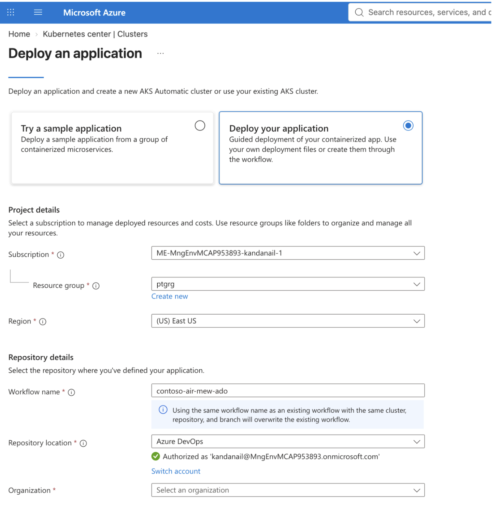

8. Select your Azure DevOps organization, project, `contoso-air` repository,
   and the `main` branch.

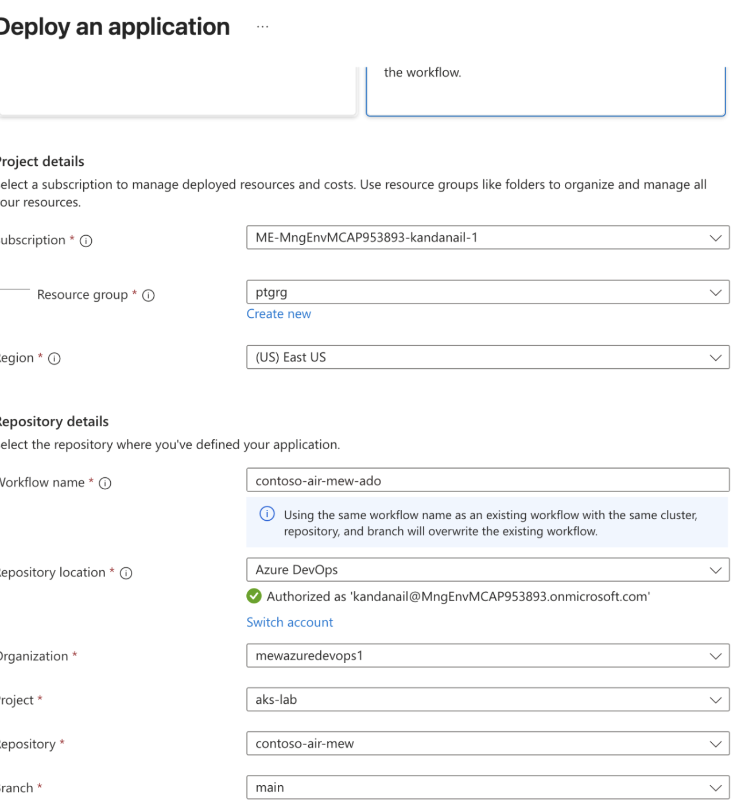

9. Select **Next**.

## 5. Configure the application image

On the **Application** tab, configure **Image**:

| Setting | Value |
| --- | --- |
| Container configuration | **Existing Dockerfile** |
| Dockerfile | Select `src/web/Dockerfile` from the repository browser |
| Dockerfile build context | `./src/web` |
| Azure Container Registry | Select the registry in the lab resource group |
| Azure Container Registry image | Select **Create new**, then enter `contoso-air` |


Under **Deployment configuration**, enter:

| Setting | Value |
| --- | --- |
| Deployment options | **Generate application deployment files** |
| Save files in repository | Select the repository **Root** folder |
| Application port | `3000` |


Select **Next**.

## 6. Select the existing AKS cluster

1. Under **Cluster configuration**, select **Existing AKS Cluster**. Do not
   create another AKS cluster.
2. Select the lab subscription, resource group, and existing AKS cluster.


3. For **Namespace**, select **Create new** and enter `dev`.


4. Leave the monitoring and logging options enabled. Select the existing lab
   monitoring resources when offered.
5. Select **Next**.
6. Review the generated Dockerfile and Kubernetes deployment files.
7. Select **Deploy**. Keep the browser page open while Azure prepares the Azure
   Pipeline and application deployment. This can take up to 20 minutes.

## 7. Review and merge the generated pull request

1. When deployment setup completes, select **Approve pull request**.

   Azure DevOps opens the generated pull request for the deployment files.

   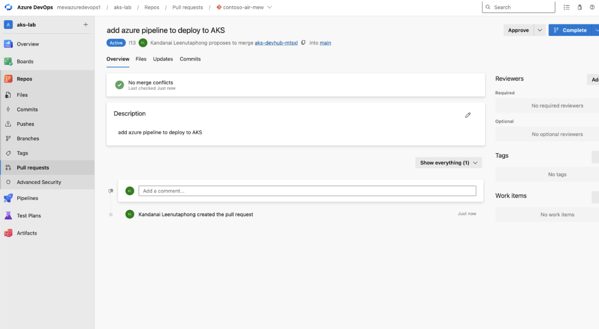

2. Select the pull request's **Files** tab and review the generated pipeline and
   Kubernetes manifest files.

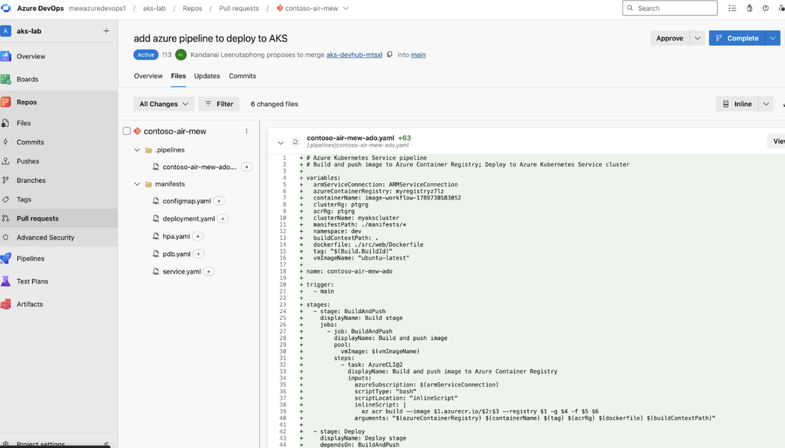

3. In **Repos** > **Files**, switch to the pull request's source branch. Open
   the generated file under `.pipelines`, select **Edit**, locate
   `buildContextPath`, and set its value to `./src/web`:

   ```yaml
   buildContextPath: ./src/web
   ```

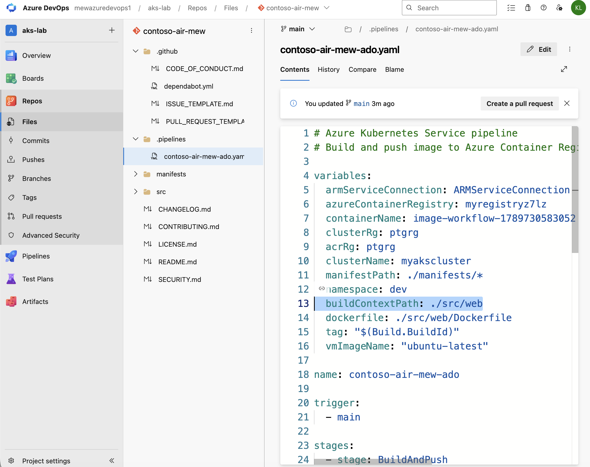

4. Select **Commit**, enter a comment such as `Update pipeline build context`,
   and commit the change to the pull request's source branch.
5. Open `manifests/deployment.yaml`, select **Edit**, and locate the
   `SYS_PTRACE` capability. AKS Automatic deployment safeguards block this
   capability, so remove the `SYS_PTRACE` line.

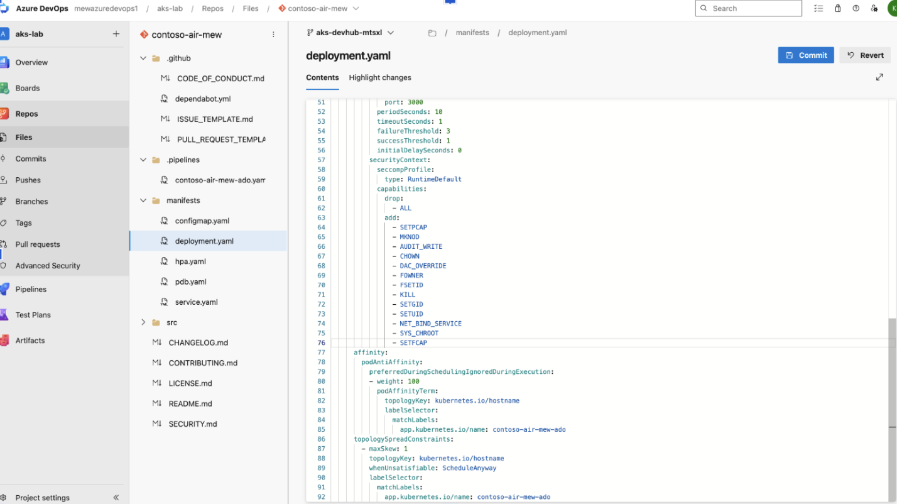

6. Select **Commit**, enter a comment such as `Update deployment manifest`, and
   commit the change to the same source branch.

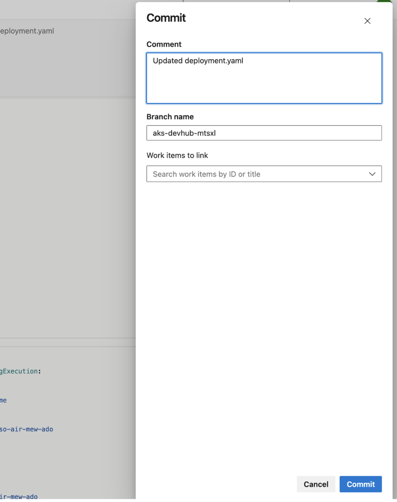

7. Return to the pull request, select **Approve**, and then select **Complete**.
   Review the merge options and select **Complete merge** to merge the changes
   into `main`.

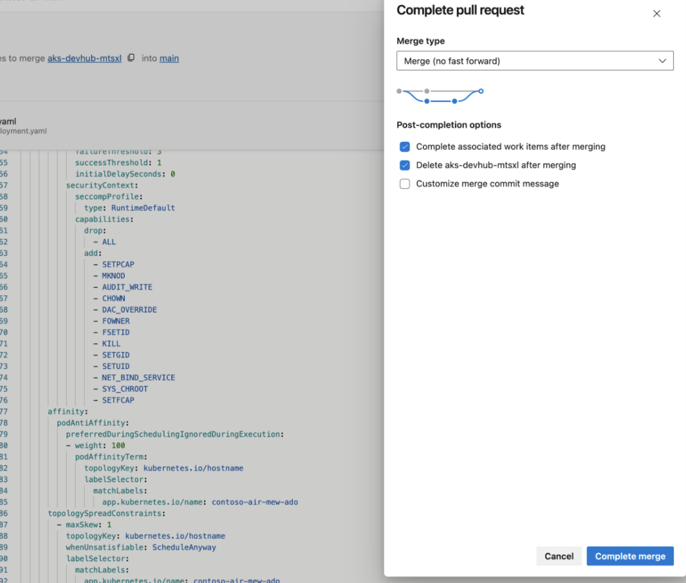

8. Open **Pipelines** and select the generated pipeline run started by the
   merge.

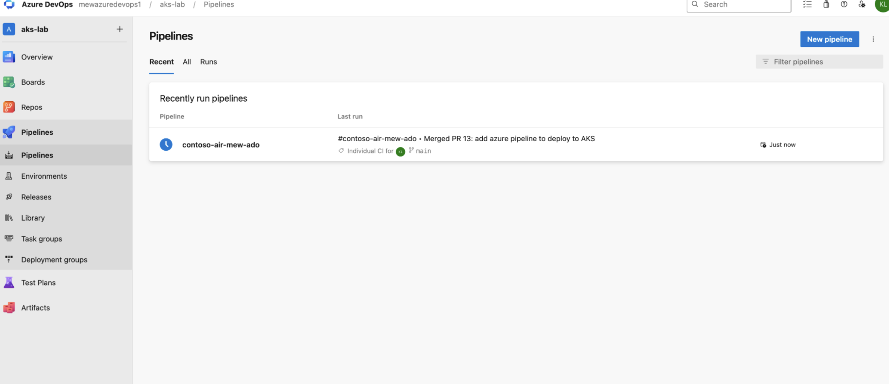

9. If the run reports that permission is needed to access the generated Azure
   service connection, open the permission check and select **Permit**. Confirm
   the permission, then rerun the pipeline if it does not resume automatically.

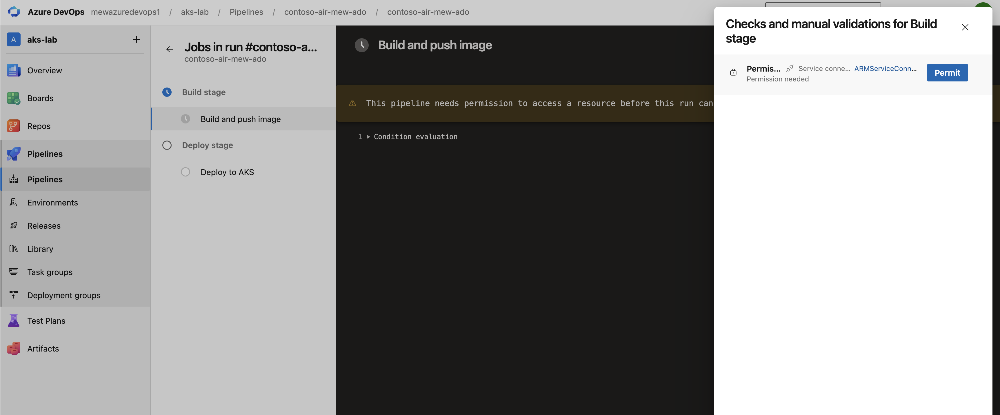

10. Wait until both the **Build stage** and **Deploy stage** succeed. This
    normally takes several minutes.

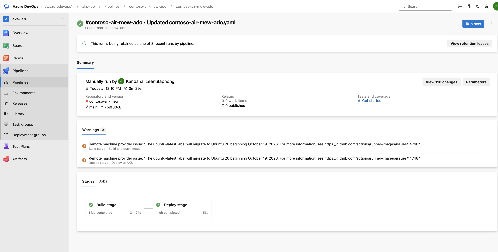

The `buildContextPath` value is required because the Contoso Air Dockerfile and
its build context are under `src/web` rather than the repository root.

## 8. Test Contoso Air before connecting it

1. In the Azure portal, open the existing AKS cluster.
2. Select **Kubernetes resources** > **Services and ingresses**.
3. Select the external IP for the `contoso-air` service.


4. Select **Ask the AI travel assistant** and send a message. The initial
   request should report that the chat provider is not configured.


## 9. Configure Contoso Air for Azure OpenAI

1. Return to the AKS cluster in the Azure portal.
2. Select **Kubernetes resources** > **Configuration**.
3. Filter by the `dev` namespace and open `contoso-air-config`.
4. Select **YAML** and replace the `data` section with:

```yaml
data:
  AZURE_OPENAI_API_VERSION: 2024-12-01-preview
  AZURE_OPENAI_DEPLOYMENT: gpt-5.4-mini
  CHAT_PROVIDER: azure
  LOG_CHAT: "true"
```

Use your actual model deployment name if you did not deploy `gpt-5.4-mini`.

5. Select **Review + save**, confirm the manifest changes, and select **Save**.


## 10. Open Service Connector

1. Open the AKS cluster and select **Settings** > **Service Connector**.
2. Select **+ Create**.


## 11. Select Azure OpenAI

On the **Basics** tab, enter:

| Setting | Value |
| --- | --- |
| Kubernetes namespace | `dev` |
| Service type | **OpenAI Service** |
| Subscription | The subscription used for this lab |
| OpenAI | The Azure OpenAI resource created in step 1 |

Select **Next: Authentication**.

## 12. Configure workload identity

1. Select **Workload Identity** and choose the user-assigned managed identity
   created by the shared-resources deployment. Its name normally begins with
   `myidentity`.
2. Expand **Advanced** and confirm that **Cognitive Services OpenAI
   Contributor** is the assigned role. Do not use secret-based authentication.


3. Select **Next: Networking**.

## 13. Create the connection

1. Keep the default public-network option, and select **Next: Review + create**.
2. Confirm the `dev` namespace, workload identity authentication, and selected
   Azure OpenAI account, then select **Create**.
3. When provisioning finishes, open the connection and confirm its status is
   **Succeeded**. If **Validate** is available, select it and confirm validation
   succeeds.

## 14. Attach the connection to Contoso Air

1. On the **Service Connector** page, select the checkbox beside the OpenAI
   connection and select **YAML snippet**.


2. For **Resource type**, select **Kubernetes Workload**.
3. For **Kubernetes Workload**, select `contoso-air`.


4. Review the highlighted service account, workload identity label, and
   connection-setting changes.
5. Select **Apply** and wait one or two minutes for the deployment rollout.


## 15. Verify Azure OpenAI from the application

1. Return to the Contoso Air browser tab and refresh it.
2. Select **Ask the AI travel assistant**.
3. Ask the assistant to find a flight.
4. Confirm that it returns an AI-generated response without a provider or
   authentication error.


## Connection complete

The successful response confirms the full path: Azure Pipelines deployed the
application to AKS Automatic, Service Connector configured workload identity,
and Contoso Air authenticated to Azure OpenAI without an API key.