# Lab 7: Connect AKS to Azure OpenAI in the Azure portal

This is the portal-only AKS Automatic and Azure OpenAI path. It forks the
Contoso Air application, deploys it to the existing lab AKS cluster with Azure
Automated Deployments, and connects the application to Azure OpenAI. You do not
need Bash, Azure CLI, GitHub CLI, or `kubectl`.

The screenshots below come from the
[AKS Automatic lab](https://azure-samples.github.io/aks-labs/docs/getting-started/aks-automatic/).
This option follows the source lab's `dev` namespace and Contoso Air application.

## Before you start

You should already have:

- The Azure resource group and shared resources from the earlier lab steps.
- The existing AKS cluster provisioned in the earlier lab steps.
- A user-assigned managed identity whose name normally begins with `myidentity`.
- A GitHub account that can create a fork and authorize Azure access.
- **Contributor** and **User Access Administrator** roles on the lab resource
   group.
- The **DevHub GitHub OAuth** custom role at subscription scope. Download the
   [custom role definition](aks-automatic/assets/devhub-github-oauth-role.json),
   replace `<subscription-id>` with your subscription ID, create the role, and
   assign it at subscription scope. If the custom role cannot be created, use
   **Contributor** at subscription scope instead.

> Azure OpenAI model availability and quota vary by subscription and region.
> This path creates an Azure OpenAI account and model deployment. These
> resources may incur charges, but the path reuses the existing lab AKS cluster.

## 1. Create an Azure OpenAI resource

1. Open the [Azure portal](https://portal.azure.com/).
2. In the top search box, enter **Azure OpenAI**.
3. Select **Azure OpenAI**, then select **Create**.
4. On **Basics**, enter:

   | Setting | Value |
   | --- | --- |
   | Subscription | The subscription used for this lab |
   | Resource group | The resource group used for this lab |
   | Region | Prefer the same region as the AKS cluster |
   | Name | A globally unique name, such as `myopenai-<your initials>` |
   | Pricing tier | `Standard S0` |

5. Select **Next** through the remaining tabs. Leave public network access
   enabled for this lab.
6. Select **Review + submit**, then **Create**.
7. When deployment finishes, select **Go to resource**.

## 2. Deploy a chat model

1. On the Azure OpenAI resource overview, select **Go to Azure AI Foundry
   portal**. If that button is not shown, open
   [Azure AI Foundry](https://ai.azure.com/) and select the Azure OpenAI
   resource.
2. Select **Model deployments** or **Deployments**.
3. Select **Deploy model** > **Deploy base model**.
4. Select `gpt-5.4-mini`. If it is unavailable, choose another chat-completion
   model available in your region and subscription.
5. Set the deployment name to the model name, then select **Deploy**. Keep the
   default deployment type and use the smallest available capacity for the lab.
6. Open the deployment in the **Chat playground**, send a short message, and
   confirm the model replies. This verifies the Azure OpenAI deployment itself.

Keep the Azure OpenAI resource name and model deployment name available for the
next section.

## 3. Fork Contoso Air in GitHub

1. Sign in to [GitHub](https://github.com/).
2. Open the [Azure-Samples/contoso-air](https://github.com/Azure-Samples/contoso-air)
   repository.
3. Select **Fork** in the upper-right corner.
4. Under **Owner**, select your GitHub account.
5. Keep the repository name `contoso-air` and select **Create fork**.
6. Confirm the page now shows `<your-github-name>/contoso-air`, not
   `Azure-Samples/contoso-air`.

## 4. Start an Automated Deployment

1. Sign in to the [Azure portal](https://portal.azure.com/).
2. Search for **Kubernetes services** and open it.
3. Select **+ Create** > **Deploy application**.

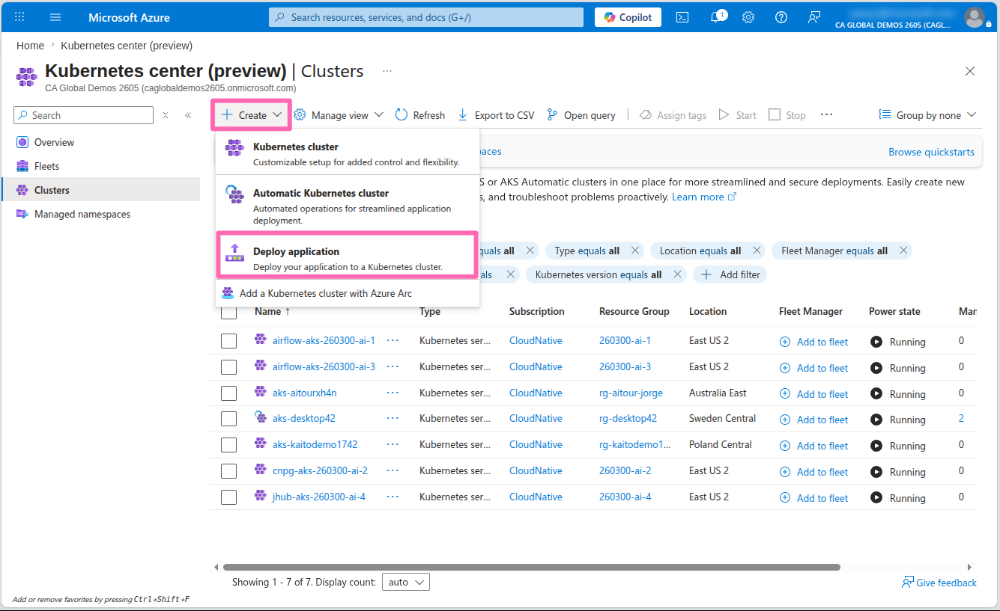

4. On **Basics**, select **Deploy your application**.
5. Select the lab subscription and resource group.
6. Set **Workflow name** to `contoso-air-<your-name>`, replacing
   `<your-name>` with your name (for example, `contoso-air-alex`).
7. Select **Authorize access** if Azure asks for access to GitHub.
8. For **Select repository**, choose your `contoso-air` fork and the `main`
   branch. Do not choose the original Azure-Samples repository.

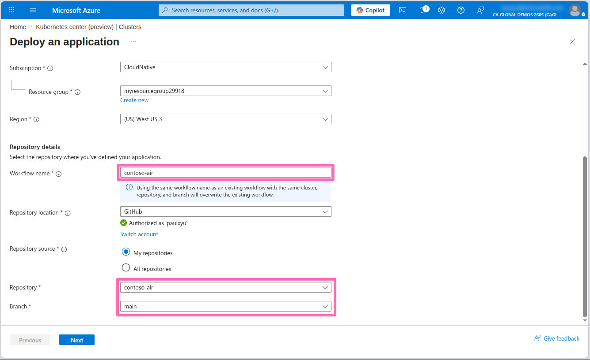

9. Select **Next**.

## 5. Configure the application image

On the **Application** tab, configure **Image**:

| Setting | Value |
| --- | --- |
| Container configuration | **Existing Dockerfile** |
| Dockerfile | Select `src/web/Dockerfile` from the repository browser |
| Dockerfile build context | `./src/web` |
| Azure Container Registry | Select the registry in the lab resource group |
| Azure Container Registry image | Select **Create new**, then enter `contoso-air` |

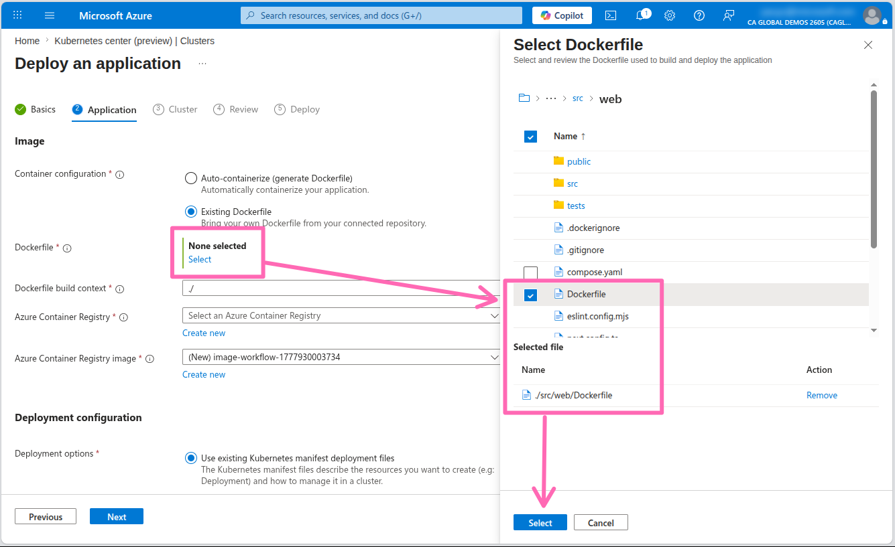

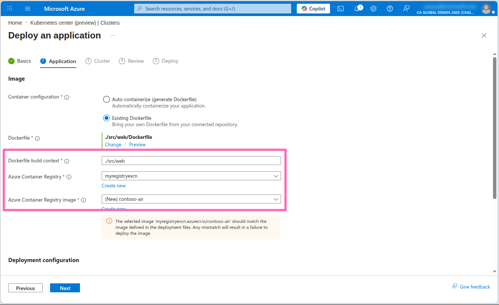

Under **Deployment configuration**, enter:

| Setting | Value |
| --- | --- |
| Deployment options | **Generate application deployment files** |
| Save files in repository | Select the repository **Root** folder |
| Application port | `3000` |

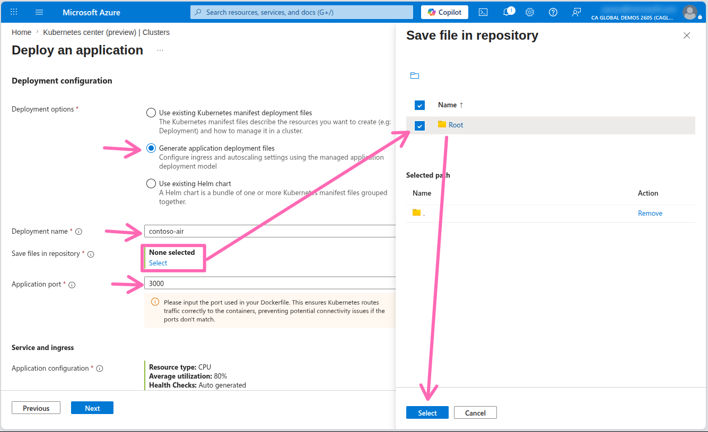

Select **Next**.

## 6. Select the existing AKS cluster

1. Under **Cluster configuration**, select **Existing AKS Cluster**. Do not
   create another AKS cluster.
2. Select the lab subscription, resource group, and existing AKS cluster.


3. For **Namespace**, select **Create new** and enter `dev`.

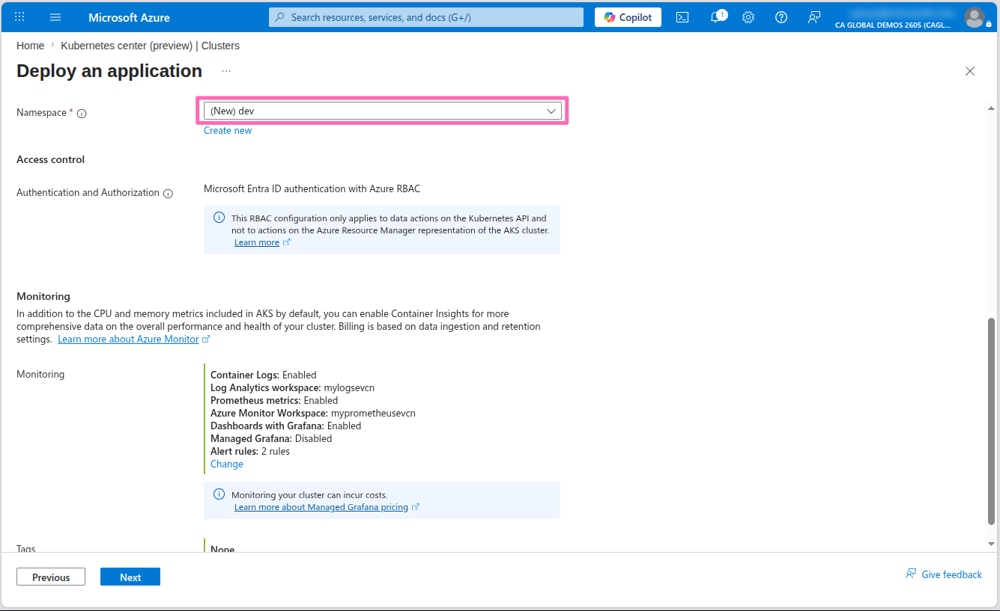

4. Leave the monitoring and logging options enabled. Select the existing lab
   monitoring resources when offered.
5. Select **Next**.
6. Review the generated Dockerfile and Kubernetes deployment files.

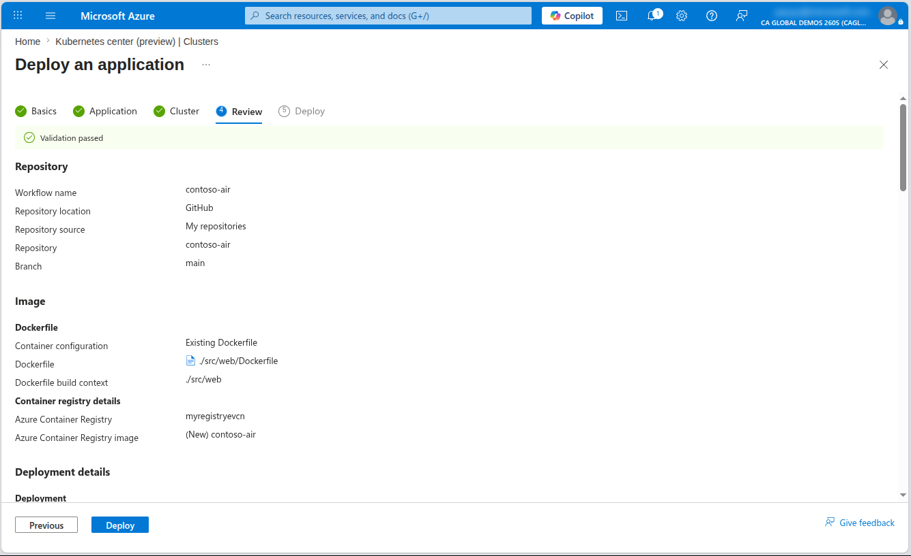

7. Select **Deploy**. Keep the browser page open while Azure prepares the GitHub
   workflow and application deployment. This can take up to 20 minutes.

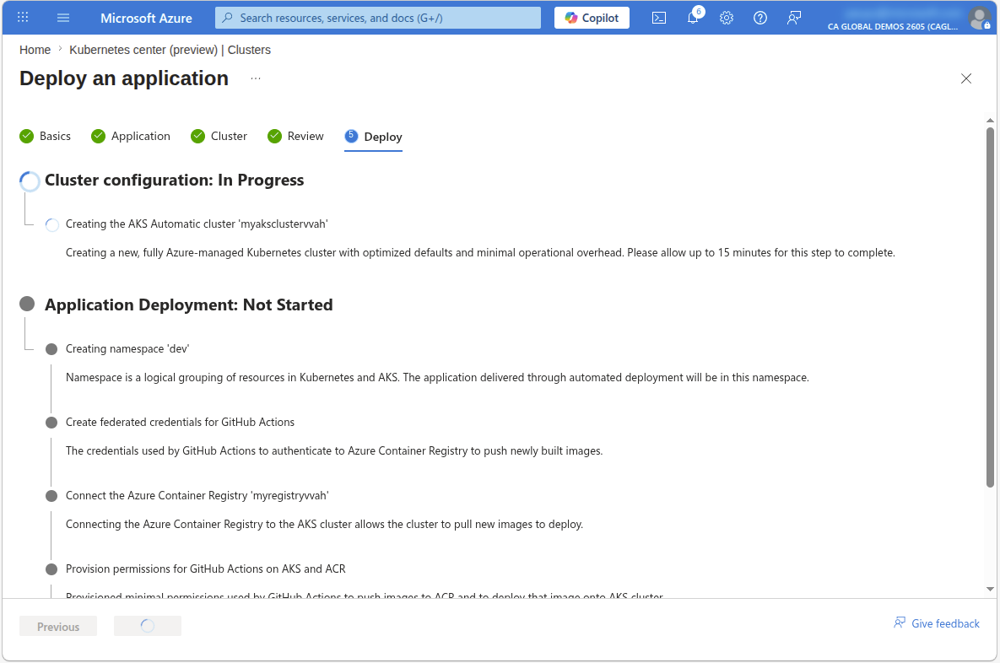

## 7. Review and merge the generated pull request

1. When deployment setup completes, select **Approve pull request**.

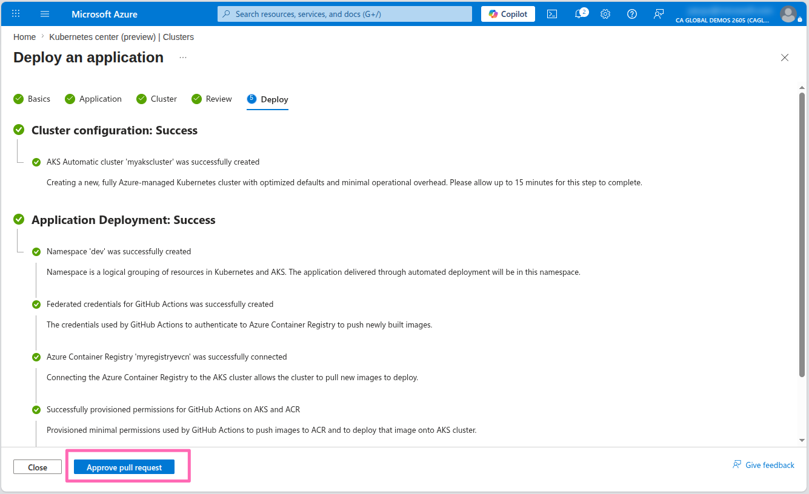

2. In GitHub, select **Files changed**.
3. Find `manifests/deployment.yaml` and locate the `SYS_PTRACE` capability.
   AKS Automatic deployment safeguards block this capability, so it must be
   removed.

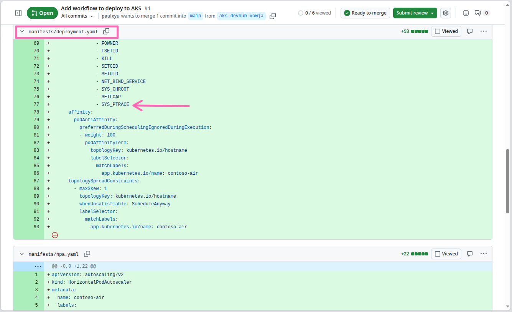

4. Hover over the `SYS_PTRACE` line, select **+**, and select **Add a
   suggestion**.
5. Delete the `SYS_PTRACE` line inside the suggestion, submit the comment, then
   select **Apply suggestion**.

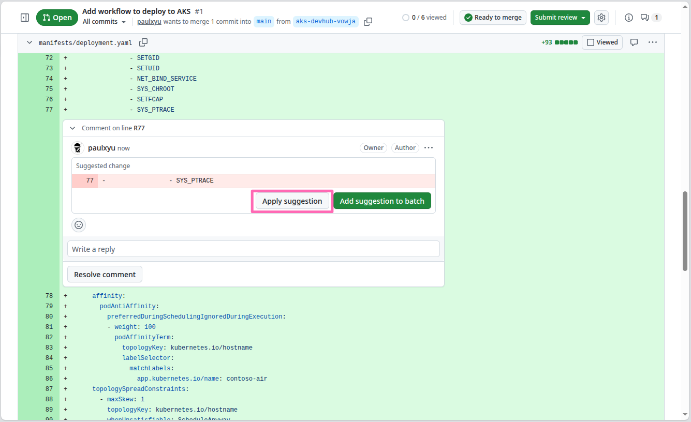

6. Return to **Conversation**, select **Merge pull request**, then **Confirm
   merge**.
7. Open the repository's **Actions** tab and select the running workflow.

### If the Azure login job fails

On the first run, the **Azure login** job may fail with `AADSTS700213: No
matching federated identity record found`. This means the user-assigned managed
identity does not yet trust the GitHub repository and branch. Create the missing
federated credential in the Azure portal:

1. In the workflow error, note the **subject claim**. It should have this form:

   `repo:<your-github-name>/contoso-air:ref:refs/heads/main`

   Newer workflows may use immutable GitHub owner and repository IDs in the
   subject instead:

   `repo:<owner>@<owner-id>/<repository>@<repository-id>:ref:refs/heads/<branch>`

   To discover those values, run this optional GitHub CLI example, replacing
   the owner and repository when needed:

   ```bash
   gh api repos/<your-username>/contoso-air \
     --jq '{owner: .owner.login, owner_id: .owner.id, repo: .name, repo_id: .id, branch: .default_branch}'
   ```

   Map the output to the subject as follows:

   - `owner` and `owner_id` become `<owner>@<owner-id>`.
   - `repo` and `repo_id` become `<repository>@<repository-id>`.
   - `branch` becomes the final branch name, normally `main`.

   For example, the resulting subject will resemble:

   `repo:<your-username>@<owner-id>/contoso-air@<repo-id>:ref:refs/heads/main`

   The subject shown in the failed **Azure login** job is authoritative. Copy it
   exactly, including letter casing and any numeric IDs.

2. In the Azure portal, search for **Managed Identities**.
3. Open the user-assigned managed identity used by the Automated Deployment. If
   the resource group contains multiple identities, select the identity whose
   client ID is referenced by the workflow's **Azure login** configuration.
4. In the identity menu, select **Settings** > **Federated credentials**.
5. Select **+ Add Credential**.
6. For **Federated credential scenario**, select **GitHub Actions deploying
   Azure resources**.
7. Enter the GitHub details:

   | Setting | Value |
   | --- | --- |
   | Organization | Your GitHub username or organization; do not include `@` |
   | Organization ID | The `owner_id` returned by `gh api` |
   | Repository | `contoso-air` |
   | Repository ID | The `repo_id` returned by `gh api` |
   | Entity type | **Branch** |
   | GitHub branch name | `main` |
   | Name | `github-contoso-air-<your-name>-main` |

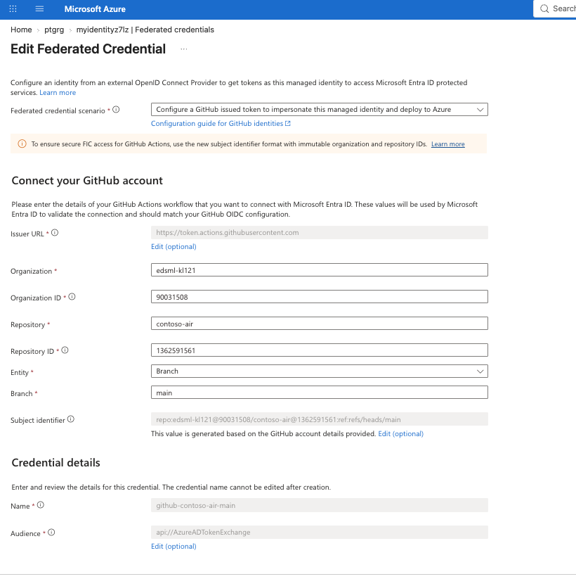

8. Before saving, verify the generated values:

   | Field | Expected value |
   | --- | --- |
   | Issuer | `https://token.actions.githubusercontent.com` |
   | Subject identifier | `repo:<owner>@<owner-id>/<repository>@<repository-id>:ref:refs/heads/main` |
   | Audience | `api://AzureADTokenExchange` |

   The subject is case-sensitive and must name your fork owner, not
   `Azure-Samples`.
   If the failed job's subject contains `@<numeric-id>` values and the GitHub
   Actions scenario does not generate the same subject, select **Other issuer**
   instead. Enter the issuer and audience shown above, then paste the exact
   subject from the error into **Subject identifier**.
9. Select **Add** and wait one or two minutes for the credential to propagate.

   The new GitHub credential should appear alongside the AKS workload identity
   credential in the managed identity's **Federated credentials** list.

   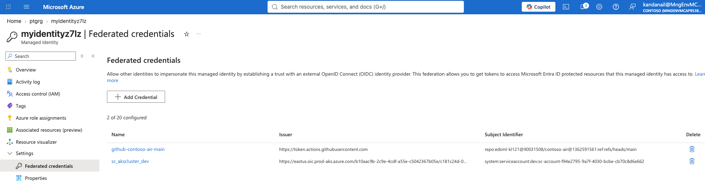

### Set the GitHub Actions secrets before rerunning

The generated workflow reads the Azure identity values from GitHub Actions
repository secrets. Add all three secrets before rerunning the failed pipeline:

1. In the Azure portal, open the user-assigned managed identity used for the
   federated credential and select **Overview**.
2. Record its **Client ID** and **Subscription ID**. Use the client ID, not the
   similarly named Object (principal) ID.

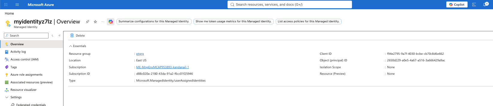

3. To find the tenant ID, search the Azure portal for **Microsoft Entra ID**,
   open **Overview**, and record the **Tenant ID**.
4. In GitHub, open your `contoso-air` fork and select **Settings** > **Secrets
   and variables** > **Actions**.
5. Under **Repository secrets**, select **New repository secret** and create
   each of these secrets:

   | Secret name | Secret value |
   | --- | --- |
   | `AZURE_CLIENT_ID` | The user-assigned managed identity **Client ID** |
   | `AZURE_SUBSCRIPTION_ID` | The Azure **Subscription ID** |
   | `AZURE_TENANT_ID` | The Microsoft Entra **Tenant ID** |

   Enter the names exactly as shown; GitHub secret names are referenced by the
   generated workflow. Do not use the managed identity's Object (principal) ID
   for `AZURE_CLIENT_ID`.
6. Confirm that all three secret names appear under **Repository secrets**.
   GitHub hides their values after they are saved.

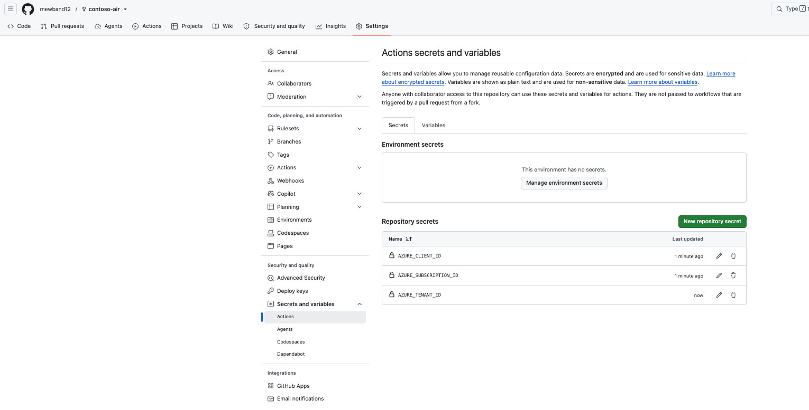

### Reduce resources before rerunning a failed deployment

The AKS cluster is shared with other students. Before rerunning a failed deploy
job, reduce the generated workload's resource requirements:

1. In your GitHub fork, open `manifests/deployment.yaml` and select **Edit**.
2. Set `spec.replicas` to `1`, or remove `replicas` to use the Kubernetes
    default.
3. Replace the generated container resource settings with the values below.
    Keep the generated container name unchanged.

    ```yaml
    spec:
       replicas: 1
       template:
          spec:
             containers:
                - name: <generated-container-name>
                   resources:
                      requests:
                         cpu: "10m"
                         memory: "256Mi"
                      limits:
                         cpu: "1"
                         memory: "512Mi"
    ```

4. Commit the change to the `main` branch.
5. If the commit does not start a new workflow automatically, return to the
    failed GitHub Actions run and select **Re-run jobs** > **Re-run failed jobs**.
6. Wait until both `buildImage` and `deploy` show green check marks. This usually
    takes 5-10 minutes.

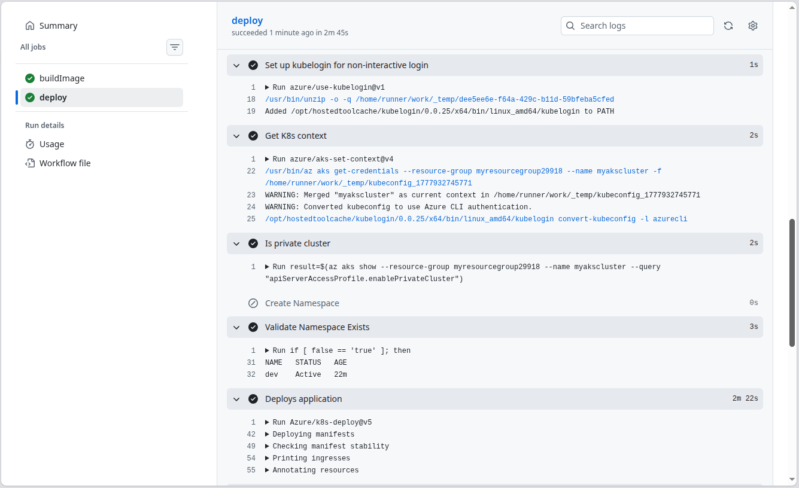

## 8. Test Contoso Air before connecting it

1. In the Azure portal, open the existing lab AKS cluster.
2. Select **Kubernetes resources** > **Services and ingresses**.
3. Select the external IP for the `contoso-air` service.

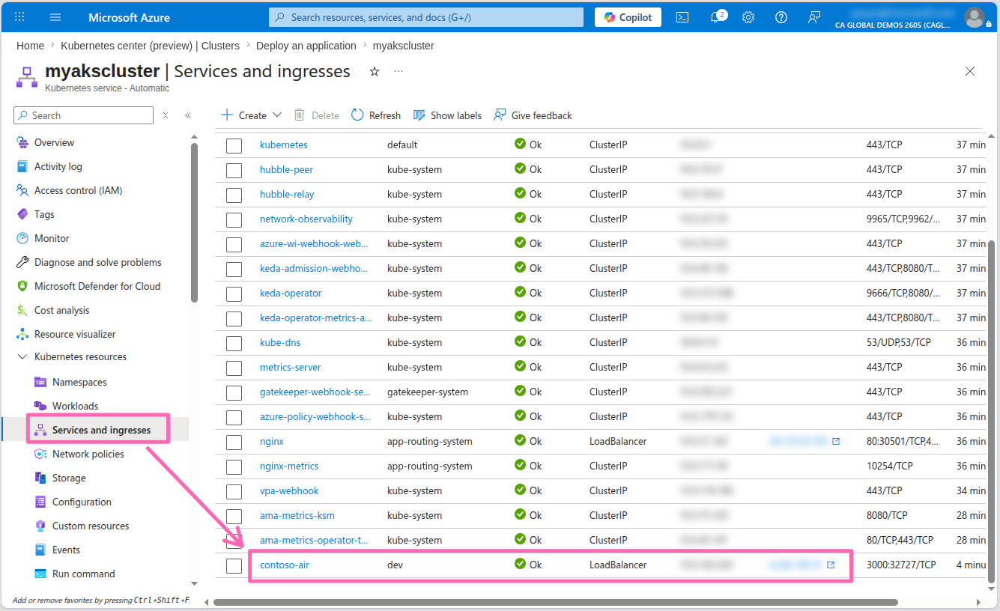

4. In Contoso Air, select **Ask the AI travel assistant** and send a message.
   The initial request should report that the chat provider is not configured.


## 9. Configure Contoso Air for Azure OpenAI

1. Return to the AKS Automatic cluster in the Azure portal.
2. Select **Kubernetes resources** > **Configuration**.
3. Filter by the `dev` namespace and open `contoso-air-config`.
4. Select **YAML** and add these entries under `data`:

```yaml
AZURE_OPENAI_API_VERSION: 2024-12-01-preview
AZURE_OPENAI_DEPLOYMENT: gpt-5.4-mini
CHAT_PROVIDER: azure
LOG_CHAT: 'true'
```

Use your actual model deployment name if you did not deploy `gpt-5.4-mini`.

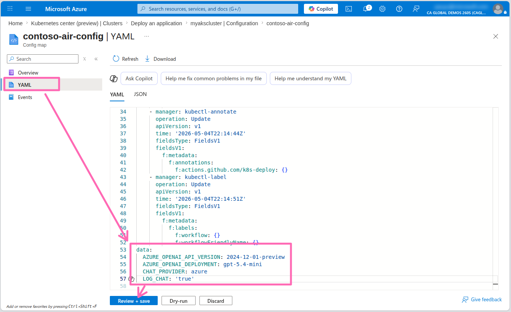

5. Select **Review + save**, confirm the manifest changes, and select **Save**.

## 10. Open Service Connector

1. Return to the [Azure portal](https://portal.azure.com/).
2. Open the existing lab AKS cluster selected in step 6.
3. In the cluster menu, select **Settings** > **Service Connector**.
4. Select **+ Create**.

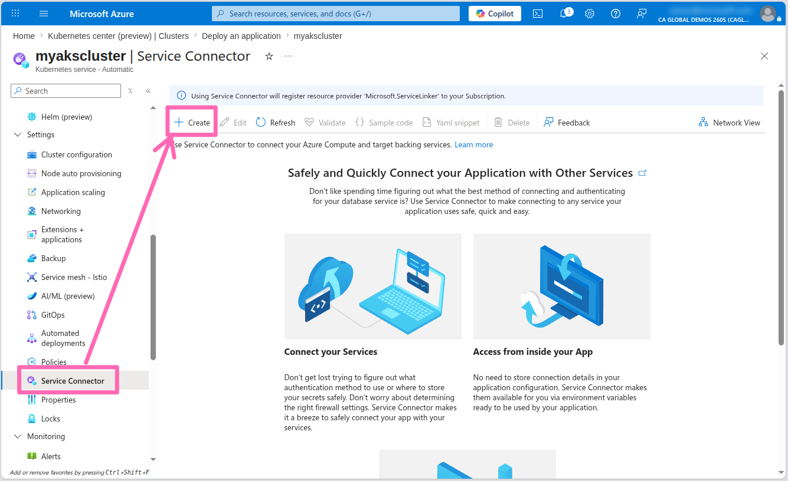

## 11. Select Azure OpenAI

On the **Basics** tab, enter:

| Setting | Value |
| --- | --- |
| Kubernetes namespace | `dev` |
| Service type | **OpenAI Service** |
| Subscription | The subscription used for this lab |
| OpenAI | The Azure OpenAI resource created in step 1 |

Select **Next: Authentication**.

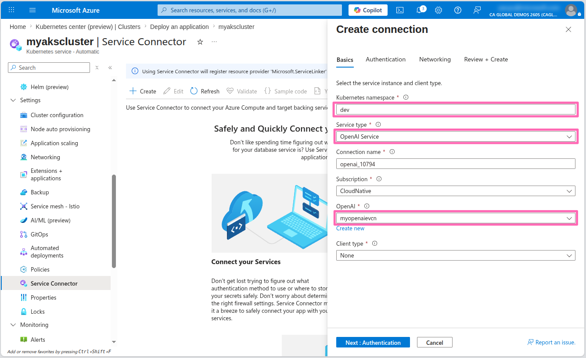

## 12. Configure workload identity

1. Select **Workload Identity**.
2. Select the user-assigned managed identity created by the shared-resources
   deployment. Its name normally begins with `myidentity`.
3. Expand **Advanced** and confirm that **Cognitive Services OpenAI
   Contributor** is the assigned role.
4. Do not select secret-based authentication. No Azure OpenAI API key is needed.
5. Select **Next: Networking**.

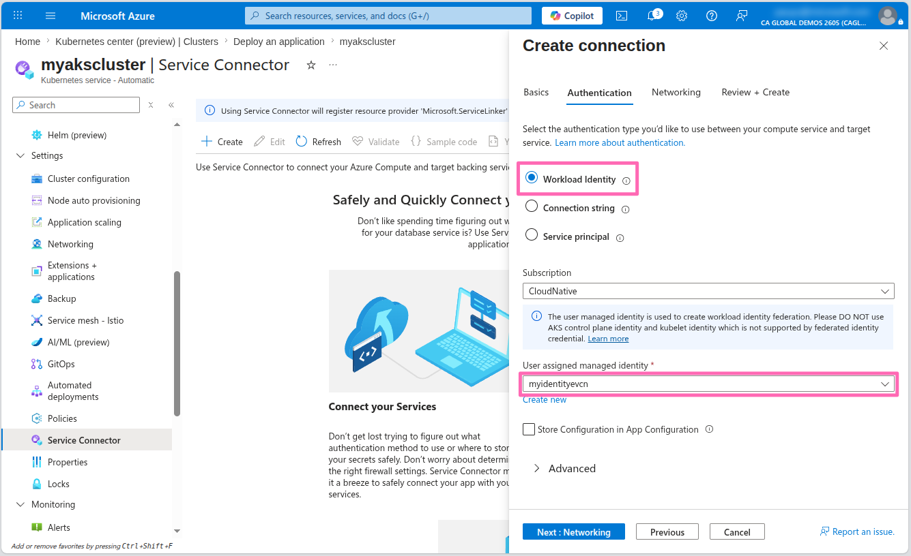

The advanced view shows the Azure role and the connection settings that Service
Connector will add to Kubernetes.

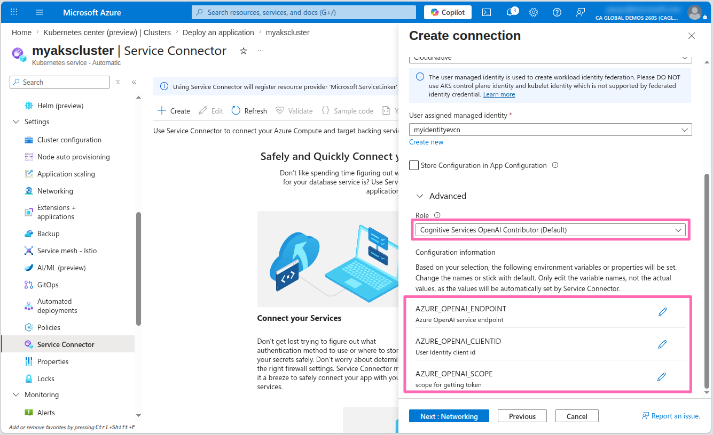

## 13. Create the connection

1. On **Networking**, keep the default public-network option for this lab, then
   select **Next: Review + create**.
2. Confirm that the namespace is `dev`, authentication is **Workload
   Identity**, and the correct Azure OpenAI account is selected.
3. Select **Create**. Provisioning can take several minutes.

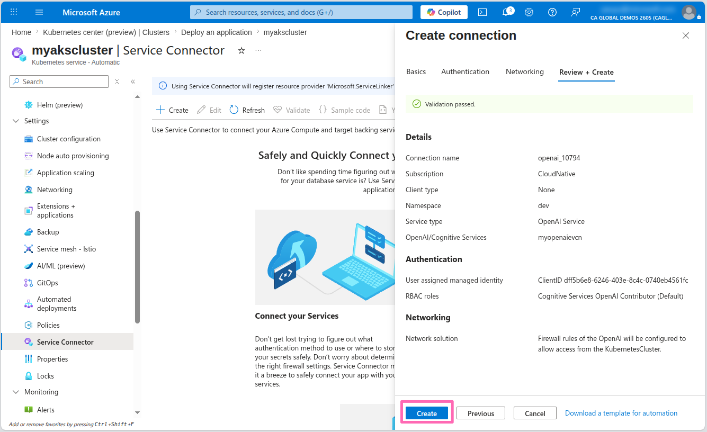

When creation finishes, return to **Settings** > **Service Connector** and open
the connection. Confirm that its provisioning or connection status is
**Succeeded**. If the page offers **Validate**, select it and confirm validation
succeeds.

Service Connector has now:

- Granted the managed identity access to Azure OpenAI.
- Created a federated identity credential for the `dev` namespace.
- Created a Kubernetes service account linked to the managed identity.
- Added the non-secret Azure OpenAI connection settings to Kubernetes.

## 14. Attach the connection to Contoso Air

1. On the **Service Connector** page, select the checkbox beside the OpenAI
   connection and select **YAML snippet**.

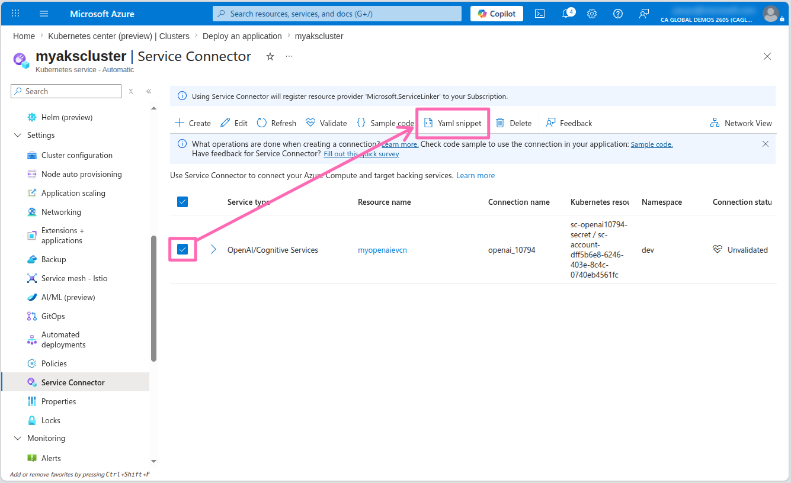

2. For **Resource type**, select **Kubernetes Workload**.
3. For **Kubernetes Workload**, select `contoso-air`.

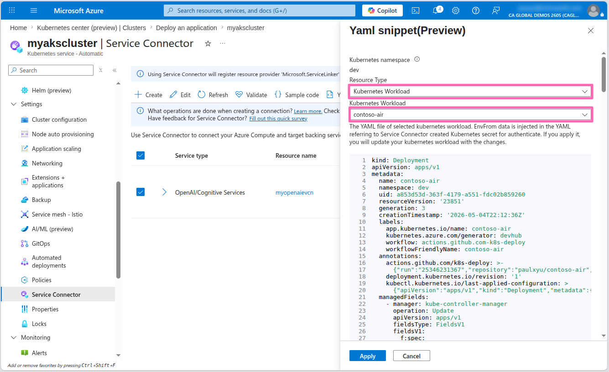

4. Review the highlighted service account, workload identity label, and
   connection-setting changes.
5. Select **Apply**. Wait one or two minutes for the deployment rollout.

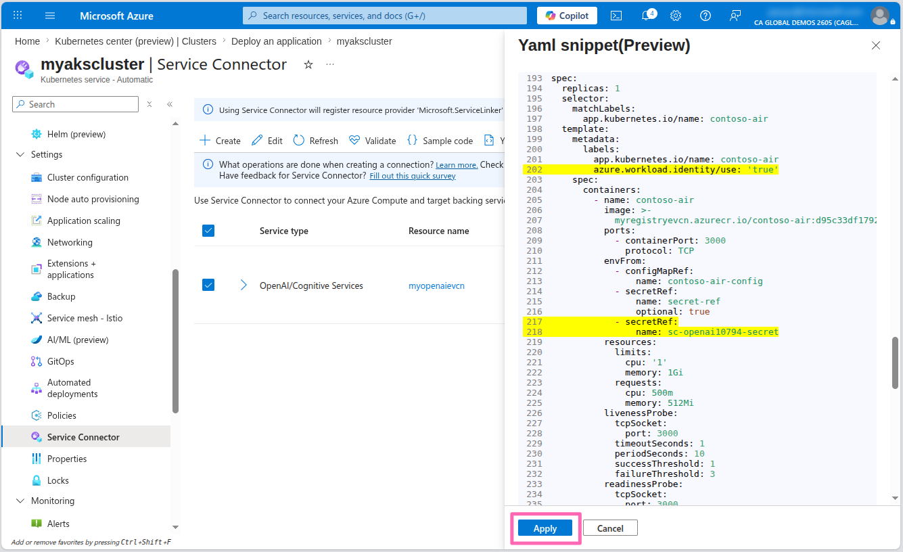

## 15. Verify Azure OpenAI from the application

1. Return to the Contoso Air browser tab and refresh it.
2. Select **Ask the AI travel assistant**.
3. Ask the assistant to find a flight.
4. Confirm it returns an AI-generated response without a provider or
   authentication error.

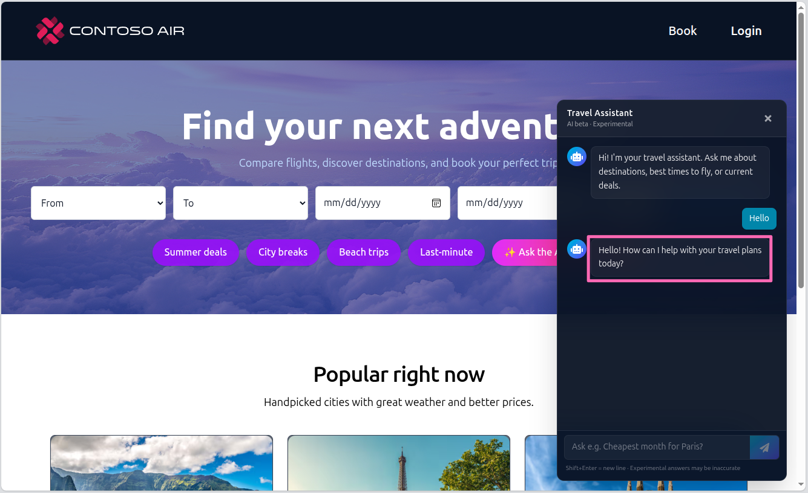

## Connection complete

The successful Contoso Air response confirms the full path: GitHub Actions
deployed the application to AKS Automatic, Service Connector configured workload
identity, and the application authenticated to the Azure OpenAI model without an
API key.