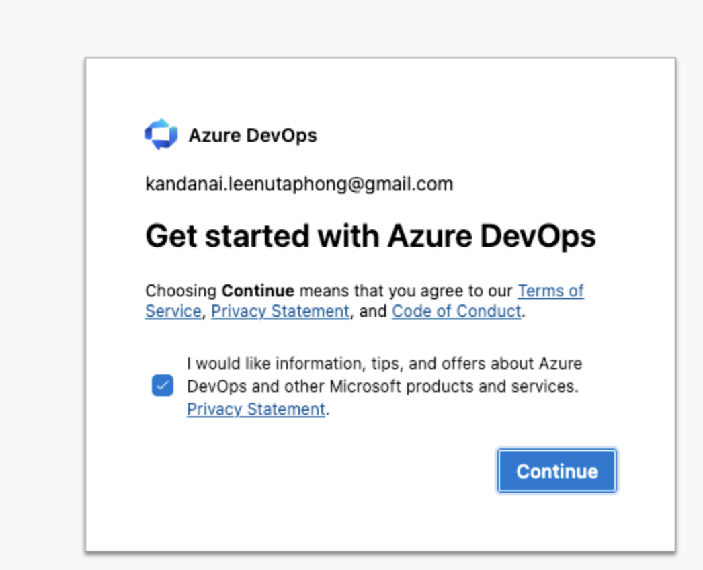
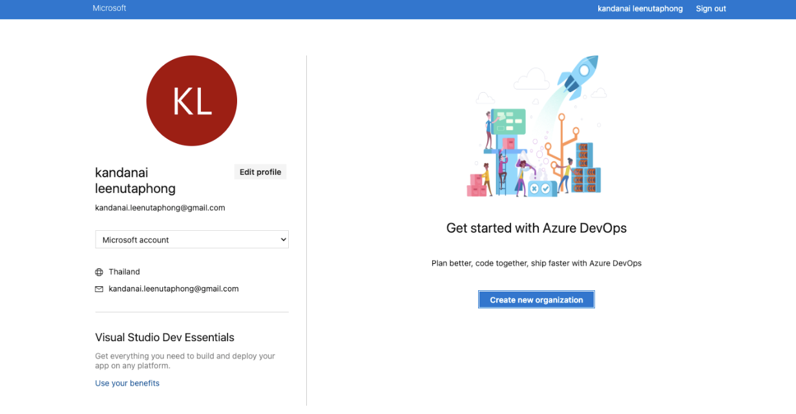
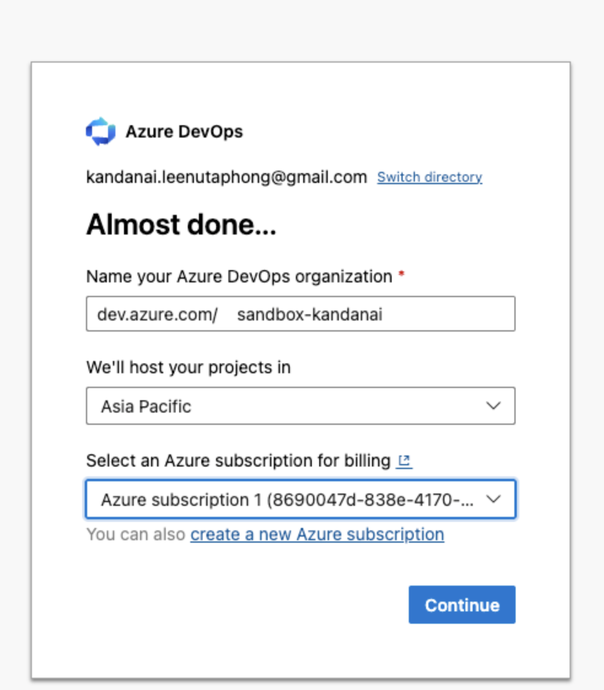
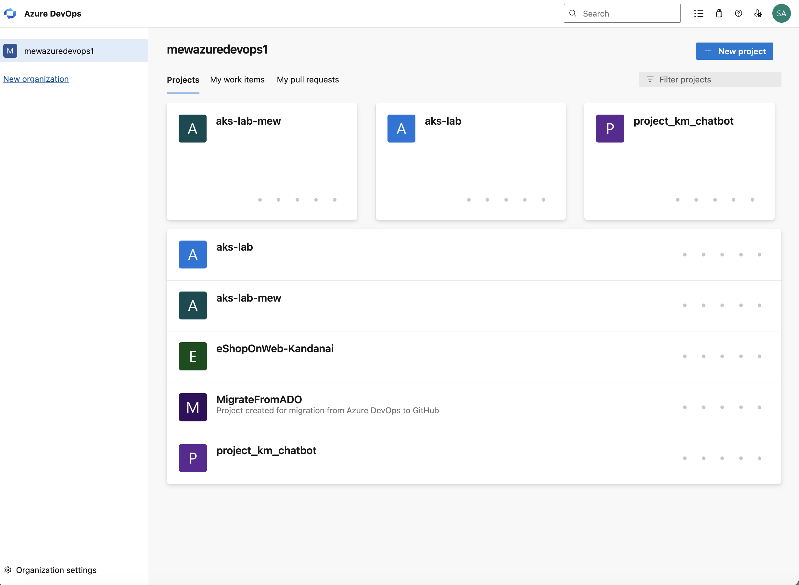
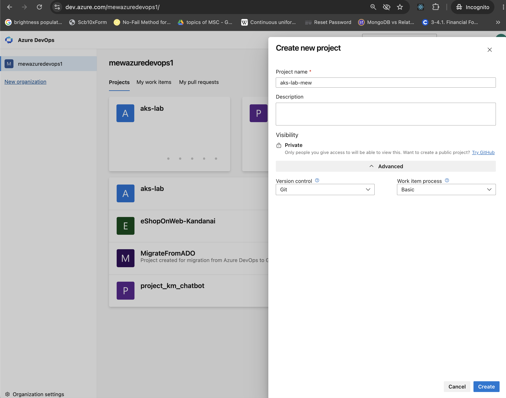
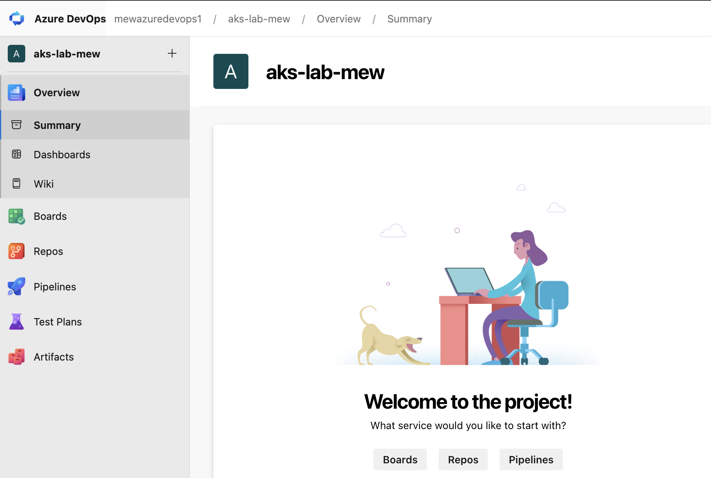
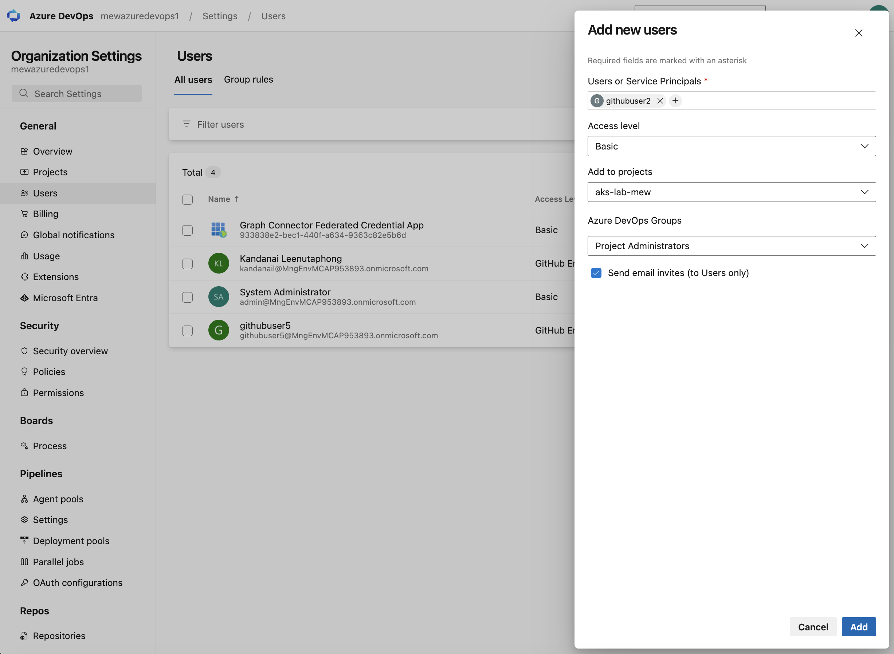
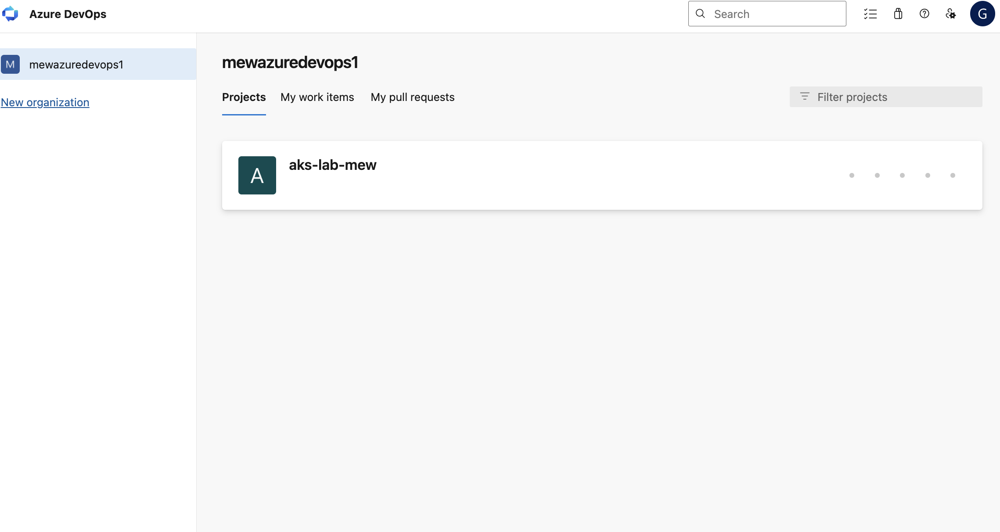

# Set up an Azure DevOps organization for Lab 7

Complete these steps if you do not already have an Azure DevOps organization
and project where you can create repositories and pipelines. For a workshop,
create a separate private project for each user and assign each user only to
their project. When setup is complete, continue with
[Lab 7: Connect AKS to Azure OpenAI with Azure DevOps](lab-7-azure-openai-portal-azure-devops.md).

## 1. Start Azure DevOps setup

1. Open [Azure DevOps](https://dev.azure.com/) and sign in.
2. If this is your first time using Azure DevOps, review the terms and optional
   communications setting, then select **Continue**.

## 2. Create an organization

1. Select **Create new organization**.

2. Enter a unique organization name.
3. Choose the region where your projects will be hosted.
4. Select the Azure subscription used for this lab, then select **Continue**.

## 3. Create a project

1. On the organization's **Projects** page, select **New project**.

2. Enter a unique project name, such as `aks-lab-<user>`.
3. Keep **Visibility** set to **Private**.
4. Under **Advanced**, keep **Version control** set to **Git** and **Work item
   process** set to **Basic**.
5. Select **Create**.

6. Confirm the project opens and the left menu includes **Repos** and
   **Pipelines**.

7. For a workshop, return to the organization's **Projects** page and repeat
   these steps until each user has a separate private project.

## 4. Invite a user to their project

1. At the bottom of the organization page, select **Organization settings**.
2. Under **General**, select **Users**, then select **Add users**.
3. Under **Users or Service Principals**, enter the user's email address or
   account name.
4. Set **Access level** to **Basic**.
5. Under **Add to projects**, select the private project created for that user.
6. Under **Azure DevOps Groups**, select **Project Administrators** so the user
   can configure the repositories, pipelines, and service connections required
   for the lab.
7. Keep **Send email invites** selected, then select **Add**.

8. Repeat these steps for each user, assigning each person only to their own
   project.

## 5. Verify project access

Ask the invited user to accept the invitation and sign in to Azure DevOps. On
the organization's **Projects** page, confirm that the user can see their
assigned project and cannot see the other private projects.

Your Azure DevOps organization, projects, and user access are ready. Continue
with the [Azure DevOps Lab 7 guide](lab-7-azure-openai-portal-azure-devops.md).
